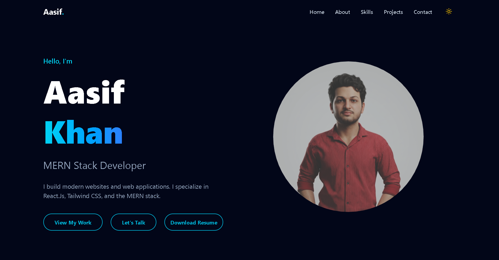

# Aasif Khan - Personal Portfolio

A modern, high-performance, and visually stunning developer portfolio built with **React 19**, **Vite**, and **Tailwind CSS v4**. This project features smooth animations using **Framer Motion** and interactive 3D elements powered by **Three.js**.



## 🚀 Setup

### Prerequisites
- **Node.js** v18+ (Recommended v20+)
- **npm** or **yarn**

### Installation

1. **Clone the repository**
   ```bash
   git clone <your-repository-url>
   cd Aasif-Portfolio
   ```

2. **Install dependencies**
   ```bash
   npm install
   ```

3. **Start the development server**
   ```bash
   npm run dev
   ```

The app will be available at `http://localhost:5173`

## 📁 Portfolio Overview

### How It Works
- **Component-Based Architecture**: The site is divided into modular sections like `Hero`, `About`, `Skills`, `Projects`, and `Contact`.
- **Theme Management**: A custom `useTheme` hook handles the dark/light mode toggle seamlessly.
- **3D Integration**: Uses `react-three-fiber` to render high-quality 3D models in the hero section.
- **Interactive UI**: Framer Motion is utilized for scroll-triggered animations and smooth transitions.

### Technical Details
- **Tailwind CSS v4**: Leveraging the latest CSS-in-JS and build-time performance optimizations.
- **Vite**: Ultra-fast bundling and Hot Module Replacement (HMR).
- **Lucide React**: Clean and consistent iconography across the site.

## 🖼️ Screenshots

| Home Page | Projects Section | Contact Form |
| :---: | :---: | :---: |
|  |  |  |

> [!NOTE]
> Add more screenshots to the `public/` folder to update this gallery.

## 🛠️ Tech Stack

- **Frontend**: React 19, Vite
- **Styling**: Tailwind CSS v4
- **Animations**: Framer Motion
- **3D Graphics**: Three.js, React Three Fiber, Drei
- **Icons**: Lucide React

## 📂 Project Structure

```text
src/
├── components/
│   ├── Hero.jsx            # Hero section with 3D model
│   ├── About.jsx           # About me section
│   ├── Skills.jsx          # Skills showcase
│   ├── Projects.jsx        # Project gallery
│   ├── ThreeDModel.jsx     # 3D canvas and model loading
│   └── ...                 # Other UI components
├── hooks/
│   └── useTheme.js         # Theme switching logic
├── App.jsx                 # Main application shell
└── main.jsx                # Entry point
```

## 📜 License
This project is for personal showcase use. Feel free to use it as inspiration!
